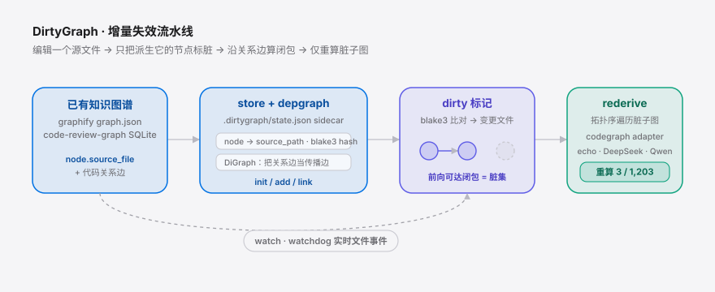
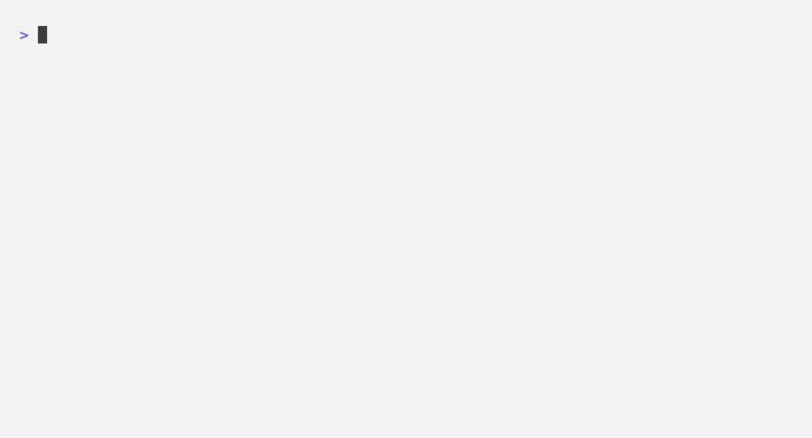

<div align="right"><sub><b>English</b>&nbsp;&nbsp;⇄&nbsp;&nbsp;<a href="./README.md">简体中文</a></sub></div>

<p align="center">
  <picture>
    <source media="(prefers-color-scheme: dark)" srcset="./assets/hero-dark.svg">
    <source media="(prefers-color-scheme: light)" srcset="./assets/hero-light.svg">
    
  </picture>
</p>

<p align="center">
  
</p>

<p align="center"><sub>Bazel-style dirty-marking for the agent code knowledge-graphs that graphify / code-review-graph build: edit one file, re-derive only the closure it feeds.</sub></p>

<p align="center">
  <a href="./LICENSE"></a>
  <a href="https://github.com/SuperMarioYL/dirtygraph/releases"></a>
  <a href="https://github.com/SuperMarioYL/dirtygraph/actions/workflows/ci.yml"></a>
  
  
  
</p>

---

**Tired of re-scanning your whole code knowledge-graph on every push? DirtyGraph marks only the nodes a changed file feeds, walks the dependency edges to the affected closure, and re-derives that subgraph alone — `re-derived 4 nodes, not 1,203`.**

DirtyGraph doesn't build graphs. It adds the incremental-invalidation primitive that Make / Bazel have used for decades to the graph you **already** have. Keep producing it with graphify or code-review-graph; DirtyGraph answers exactly one question when a file changes: *which derived nodes are stale now?*

## Contents

- [Architecture](#architecture)
- [Install](#install)
- [Quickstart](#quickstart)
- [Usage](#usage)
- [Demo](#demo)
- [Why it exists](#why-it-exists)
- [vs graphify](#vs-graphify)
- [Configuration](#configuration)
- [Roadmap](#roadmap)
- [License](#license)

<h2 id="architecture"> Architecture</h2>

A single Python package plus a single CLI, no server. It reads the graph you already have, sidecars a self-owned blake3 hash beside each node's single source-file provenance, and reinterprets the graph's code-relation edges as propagation edges — when a file changes, the nodes forward-reachable along those edges are the dirty closure.

<p align="center">
  <picture>
    <source media="(prefers-color-scheme: dark)" srcset="./assets/atlas-dark.svg">
    <source media="(prefers-color-scheme: light)" srcset="./assets/atlas-light.svg">
    
  </picture>
</p>

| Module | Responsibility |
|---|---|
| `cli.py` | Typer commands: `init` / `add` / `link` / `status` / `rederive` / `watch` |
| `store.py` | Read/write the `.dirtygraph/state.json` sidecar (source path + our blake3 hashes + dirty bits) |
| `depgraph.py` | `networkx.DiGraph`: nodes + relation edges, forward-reachable closure over them |
| `dirty.py` | blake3 diff → changed files → dirty closure |
| `rederive.py` | Topo-sort the dirty closure, call the adapter per node |
| `adapters/codegraph.py` | Two loaders (graphify node-link JSON / code-review-graph SQLite) + optional DeepSeek / Qwen re-derive |

<h2 id="install"> Install</h2>

```bash
pip install dirtygraph        # or: uv pip install dirtygraph
```

Requires Python ≥ 3.12. The `echo` adapter runs with zero network deps — the DeepSeek / Qwen re-derive path only goes over the wire once you set its env vars.

<h2 id="quickstart"> Quickstart</h2>

Three steps from a cold clone to the benchmark line:

```bash
dirtygraph init ./graph.json     # 1. adopt a graph you already have; blake3-hash each source
# 2. edit any one source file...
dirtygraph status                # 3. see the dirty closure: 4 dirty of 1,203
dirtygraph rederive --adapter codegraph   # re-derive only the dirty subgraph: re-derived 4 nodes (of 1,203)
```

<details><summary>sample output</summary>

```text
$ dirtygraph init ./graph.json
initialised 1,203 nodes (3 edges, 1,203 sources) from graphify graph
  state: .dirtygraph/state.json

# after editing auth.py:
$ dirtygraph status
dirty closure: 4 dirty of 1,203
  changed sources: 1
  direct hits: 1 | propagated: 3

$ dirtygraph rederive --adapter codegraph
re-derived 4 nodes (of 1,203)

# run it again with no edits:
$ dirtygraph rederive --adapter codegraph
re-derived 0 nodes (of 1,203)
```
</details>

<h2 id="usage"> Usage</h2>

`init` ingests a graph file, but you can also wire a graph up node-by-node from a script — no importable graph file needed:

```bash
# wire a propagation chain manually (a change to source restages target)
dirtygraph add  auth-node  auth.py    --label "auth module"
dirtygraph add  views-node views.py   --label "views layer"
dirtygraph link auth-node  views-node --relation IMPORTS

# an editor / agent just wrote one file — re-check only that path
dirtygraph touch auth.py

# live-track file events across the tree
dirtygraph watch --root .
```

| Command | What it does |
|---|---|
| `init <graph>` | Ingest a graphify `graph.json` or a `.code-review-graph/` SQLite store; build the sidecar + propagation graph |
| `add <id> <src>` | Register one derived node + its source dependency |
| `link <src> <tgt>` | Register a propagation edge (`src` change → restage `tgt`) |
| `status` | Print the dirty closure `N dirty of TOTAL` (no re-derive) |
| `rederive` | Re-derive ONLY the dirty closure and print the before/after benchmark |
| `watch` | watchdog live file-event loop |

**Domestic-model re-derive**: hand the dirty closure to DeepSeek / Qwen for re-summarization via env vars (any OpenAI-compatible endpoint):

```bash
export DIRTYGRAPH_LLM=1
export DIRTYGRAPH_LLM_API_KEY=sk-...
export DIRTYGRAPH_LLM_BASE_URL=https://api.deepseek.com/v1   # Qwen: point at a DashScope endpoint
export DIRTYGRAPH_LLM_MODEL=deepseek-chat                    # or qwen-plus
dirtygraph rederive --adapter codegraph
```

<h2 id="demo"> Demo</h2>



The last frame is the star-the-repo moment: `re-derived 4 nodes (of 1,203)`.

<h2 id="why-it-exists"> Why it exists</h2>

Agent-maintained docs and codebase knowledge-graphs drift silently out of sync with their source. You edit `auth.py`, and the graph node for the auth module — plus every summary derived from it — should be marked dirty. Instead, today's tools either trust the stale node or trigger a full re-scan. The first feeds an Agent confidently-wrong context; the second ties re-index latency and token spend to repo size rather than change size on exactly the large repos where a persistent map earns its keep.

`graphify` (71k stars) and `code-review-graph` (18.8k stars) do "folder → queryable graph" beautifully — but their build model is a **scan**, not an incremental dirty-closure update. DirtyGraph competes on neither; it supplies the missing edge: **source-file → derived-node invalidation**, so one file change marks only the affected closure. That's the same gap a literal *Show HN* on staleness-checking docs (Treedocs) surfaced — checking staleness is a full-scan probe; DirtyGraph closes the loop and re-derives only the stale closure. It's also what an Agent reading a project graph from a *Gemini CLI*-style toolchain needs: the bigger and more frequently-read the graph, the more wasteful a full re-scan becomes.

<h2 id="vs-graphify"> vs graphify</h2>

This is positioning, not bragging — [graphify](https://github.com/safishamsi/graphify) is clearly better at what it's for:

| Capability | [graphify](https://github.com/safishamsi/graphify) | DirtyGraph |
|---|:---:|:---:|
| Build a queryable knowledge-graph from a folder | ✓ | — (deliberately out of scope; brings your own) |
| Input breadth (code / SQL / docs / images / video) | ✓ | partial (v0.1: graphify JSON + CRG SQLite) |
| Incremental invalidation on file change | — (full re-scan) | ✓ (marks only the affected closure) |
| Re-derive only the dirty subgraph (before/after benchmark) | — | ✓ |
| Domestic-model (DeepSeek / Qwen) re-derive adapter | — | ✓ |

In one line: graphify builds the graph beautifully; DirtyGraph makes one file change re-derive only the nodes it feeds.

<h2 id="configuration"> Configuration</h2>

The optional domestic-model re-derive path is driven entirely by env vars:

| Variable | Default | Meaning |
|---|---|---|
| `DIRTYGRAPH_LLM` | `0` | Set to `1` to enable LLM re-derive; otherwise the zero-dep echo path is used |
| `DIRTYGRAPH_LLM_API_KEY` | — | API key for an OpenAI-compatible endpoint (required when enabled) |
| `DIRTYGRAPH_LLM_BASE_URL` | `https://api.deepseek.com/v1` | Endpoint; point at a DashScope-compatible URL for Qwen |
| `DIRTYGRAPH_LLM_MODEL` | `deepseek-chat` | Model name, e.g. `qwen-plus` |
| `DIRTYGRAPH_LLM_TIMEOUT` | `30` | Per-request timeout (seconds) |

<h2 id="roadmap"> Roadmap</h2>

- [x] **m1 · Provenance tracking** — `init` ingests an existing graph, blake3-hashes each source, persists `.dirtygraph/state.json`
- [x] **m2 · Dirty-closure marking** — build a `networkx` graph from relation edges; on a file change compute the forward-reachable closure and set dirty bits
- [x] **m3 · Dirty-subgraph re-derive** — `rederive` topo-sorts the dirty closure, calls the adapter per node, prints the before/after benchmark
- [ ] More loaders (GraphML / Neo4j exports / Obsidian vault)
- [ ] AST / blame-level provenance, beyond v0.1 file-content hashing
- [ ] More re-derive adapters (local Ollama, custom HTTP endpoints)

<h2 id="license"> License</h2>

MIT, free and open source, no paywalled feature. Feedback welcome on the [issue tracker](https://github.com/SuperMarioYL/dirtygraph/issues) — especially after you point DirtyGraph at your own graphify / code-review-graph output.

## Share this

```text
DirtyGraph — Bazel-style dirty-marking for agent code knowledge-graphs. Edit one file, re-derive 4 nodes instead of re-scanning 1,203. Built-in DeepSeek / Qwen re-derive. https://github.com/SuperMarioYL/dirtygraph
```

<p align="center"><sub><a href="./LICENSE">MIT</a> © 2026 SuperMarioYL</sub></p>
