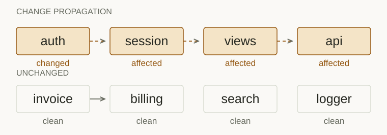

<div align="right"><strong>English</strong> · <a href="./README.md">简体中文</a></div>

<picture>
  <source media="(prefers-color-scheme: dark)" srcset="assets/hero-dark.svg">
  
</picture>

**After a source edit, re-derive only the affected graph nodes.** DirtyGraph tracks file changes for an existing code graph, finds the affected nodes and calls the re-derivation logic in dependency order. Unrelated nodes stay untouched.

[Interactive demo](https://dirtygraph.lei6393.com/#demo) · [Quickstart](#quickstart) · [Usage guide](docs/usage.md) · [Test status](https://github.com/SuperMarioYL/dirtygraph/actions/workflows/ci.yml) · [Apache-2.0](LICENSE)

## See an actual run

This example contains **8 real source files and 8 graph nodes**. Editing `auth.py` affects the 4 nodes in `auth → session → views → api`; the other 4 nodes are unaffected. Arrows show change propagation.

<picture>
  <source media="(prefers-color-scheme: dark)" srcset="assets/flow-dark.svg">
  
</picture>

```text
$ dirtygraph status --why
dirty closure: 4 dirty of 8
  changed sources: 1
  direct hits: 1 | propagated: 3

$ dirtygraph rederive --adapter codegraph --verbose
dirty closure: 4 dirty of 8
re-derived 4 nodes (of 8)
  + auth
  + session
  + views
  + api

$ dirtygraph rederive --adapter codegraph
dirty closure: 0 dirty of 8
re-derived 0 nodes (of 8)
```

This is actual output from the [example script](examples/demo.py), with the complete transcript in [demo-results.json](docs/demo-results.json). It verifies change detection and re-derivation scope. It is not a benchmark of elapsed time, token savings or summary quality.

<details><summary>Watch the terminal recording</summary>


</details>

## Quickstart

Requires Python 3.12 or later. On macOS / Linux:

```bash
git clone https://github.com/SuperMarioYL/dirtygraph.git
cd dirtygraph
python3 -m venv .venv
source .venv/bin/activate
python -m pip install -e .
python examples/demo.py
```

The script creates temporary source files and a dependency graph, then initializes, edits a file, checks the impact, re-derives nodes and runs again. It cleans up afterward. **No existing `graph.json`, API key or model service is required.**

## Use your own graph

For developers who already have a code graph and need to maintain derived nodes after source edits. Supports graphify node-link JSON and code-review-graph SQLite. Your graph must supply source-file paths and dependency edges.

```bash
dirtygraph init /path/to/graph.json
cd /path/to
# Edit a source file referenced by the graph.
dirtygraph status --why
dirtygraph rederive --adapter codegraph
```

| Task | Command |
|---|---|
| Explain why each affected node is stale | `dirtygraph status --why` |
| Check only the file just edited | `dirtygraph touch auth.py` |
| Watch source edits and mark affected nodes | `dirtygraph watch --root .` |
| Register nodes and propagation edges manually | `dirtygraph add` / `dirtygraph link` |

See the [usage guide](docs/usage.md) for parameters, graph formats and optional model settings.

## How it works and its limits

DirtyGraph compares source content hashes, propagates changes through the input graph's dependency edges, then calls an adapter for affected nodes in topological order. Successful calls checkpoint state in `.dirtygraph/`; failed nodes stay marked for re-derivation.

- **Dependencies come from the input.** DirtyGraph does not infer source dependencies or build a graph. Correct impact analysis depends on the supplied edges and source mapping.
- **The imported graph is not modified.** The CLI checkpoints its own state but does not write derived content back to the imported graph. Applications must persist derived content in their adapter.
- **The local example does not call a model.** The `codegraph` adapter produces local summaries by default. Model calls require separate configuration; this example does not evaluate model summary quality.
- **Fewer re-derived nodes do not imply a fixed speedup.** Actual cost depends on graph structure, source size and adapter work.

## Development

```bash
python -m pip install -e '.[dev]'
pytest -q
python examples/demo.py
```

To refresh the demo, run `python examples/demo.py --json-output docs/demo-results.json`, then `python docs/render_demo_assets.py`. The website and SVGs use the same verified result. Record the terminal with `vhs docs/demo.tape`.

[Open an issue](https://github.com/SuperMarioYL/dirtygraph/issues) with the input graph format, command and expected result.

[Apache-2.0](LICENSE) © 2026 SuperMarioYL
