<div align="right"><sub><a href="./README.en.md">English</a> · <b>简体中文</b></sub></div>

<p align="center"><picture><source media="(max-width: 640px) and (prefers-color-scheme: dark)" srcset="./assets/hero-mobile-dark.svg"><source media="(max-width: 640px)" srcset="./assets/hero-mobile-light.svg"><source media="(prefers-color-scheme: dark)" srcset="./assets/hero-dark.svg"></picture></p>

<p align="center"><b>改一处，不必重算整张图。</b><br><sub>为已有代码图谱加上变更追踪、依赖传播和增量重算。</sub></p>

<p align="center">
<a href="./LICENSE"></a>
<a href="https://github.com/SuperMarioYL/dirtygraph/actions/workflows/ci.yml"></a>

<a href="https://github.com/SuperMarioYL/dirtygraph/releases"></a>
</p>
<p align="center"><a href="https://dirtygraph.lei6393.com">网站</a> · <a href="#快速开始">快速开始</a> · <a href="#demo">看 Demo</a> · <a href="./docs/usage.md">命令参考</a> · <a href="https://github.com/SuperMarioYL/dirtygraph/issues">反馈</a></p>

## 为什么需要 DirtyGraph

代码改了，Agent 读到的摘要却可能还停在昨天。你修改 `auth.py`，认证模块的节点需要更新；依赖它的会话逻辑、视图和 API 说明，也可能一起过时。每次重新生成整张图能解决问题，但会把大量没有变化的内容再处理一遍。

DirtyGraph 把构建系统里成熟的增量更新思路用到代码图谱上：**记录节点来自哪个文件，追踪它依赖谁，再把重算限定在受影响的子图内。** 你继续用现有工具构建图谱，DirtyGraph 负责回答“这次改动之后，哪些派生节点该重新计算”。

它适合已经有代码图谱、文档摘要或其他派生任务的工作流。图越大，全量处理越不划算；不过真正决定重算范围的，是改动在依赖图里能传播多远。

<p align="center"><picture><source media="(max-width: 640px) and (prefers-color-scheme: dark)" srcset="./assets/process-mobile-dark.svg"><source media="(max-width: 640px)" srcset="./assets/process-mobile-light.svg"><source media="(prefers-color-scheme: dark)" srcset="./assets/process-dark.svg"></picture></p>

这个八文件示例中，修改 `auth.py` 后，`auth → session → views → api` 需要重算。`invoice`、`billing`、`search`、`logger` 不受影响。重算成功后再运行一次，新增更新为零。

## 目录

[架构](#架构) · [安装](#安装) · [快速开始](#快速开始) · [用法](#用法) · [Demo](#demo) · [能力与集成](#能力与集成) · [配置](#配置) · [路线图](#路线图)

## 架构

一个 Python 包，一套 CLI，不需要常驻图谱服务。源文件的 BLAKE3 哈希、脏位和检查点保存在独立的 `.dirtygraph/` sidecar 中；依赖图负责找出影响范围，adapter 负责具体的派生任务。

<p align="center"><picture><source media="(max-width: 640px) and (prefers-color-scheme: dark)" srcset="./assets/architecture-mobile-dark.svg"><source media="(max-width: 640px)" srcset="./assets/architecture-mobile-light.svg"><source media="(prefers-color-scheme: dark)" srcset="./assets/architecture-dark.svg"></picture></p>

| 模块 | 做什么 |
|---|---|
| `cli.py` | 提供 `init`、`status`、`rederive`、`watch` 等命令 |
| `store.py` | 保存源路径、内容哈希、脏位和成功检查点 |
| `depgraph.py` | 用 `networkx.DiGraph` 表示传播关系，求受影响的可达闭包 |
| `dirty.py` | 比对文件哈希，找到直接变化与依赖传播的节点 |
| `rederive.py` | 对脏子图做拓扑排序，逐节点调用 adapter，成功后更新状态 |
| `adapters/codegraph.py` | 读取两类已有图谱；生成本地摘要，或调用兼容端点生成模型摘要 |

在这里，“脏”表示一个派生节点需要重新计算。`status --why` 会进一步区分：它的源文件直接变了，还是变化从某条依赖路径传过来了。adapter 调用失败的节点保留脏位，便于下一次继续处理。

**派生内容的存储由接入方负责。** CLI 更新自己的检查点，不会把新摘要写回导入的 JSON 或 SQLite。要维护应用里的实际摘要、索引或文档，在自定义 adapter 中把输出写入对应存储。

## 安装

需要 **Python 3.12+**。从源码安装，同时获取下面使用的完整示例：

```bash
git clone https://github.com/SuperMarioYL/dirtygraph.git
cd dirtygraph
python3 -m venv .venv
source .venv/bin/activate
python -m pip install -e .
```

默认的 `echo` 和 `codegraph` adapter 都可以本地运行，不需要模型服务或 API Key。

## 快速开始

先跑一条完整的依赖链：

```bash
python examples/demo.py
```

示例会在临时目录创建八个 Python 源文件和一份图谱，依次执行初始化、修改 `auth.py`、解释影响范围、重算、再次重算。结束后清理临时目录。

```text
# 初始状态
dirty closure: 0 dirty of 8

# 修改 auth.py 后
dirty closure: 4 dirty of 8
  changed sources: 1
  direct hits: 1 | propagated: 3

# 第一次重算
re-derived 4 nodes (of 8)

# 没有新修改，再跑一次
re-derived 0 nodes (of 8)
```

接下来，在你自己的项目目录中接入已有图谱：

```bash
cd /path/to/your-project
dirtygraph init ./graph.json
# 修改图谱中某个节点关联的源文件。
dirtygraph status --why
dirtygraph rederive --adapter codegraph
```

`graph.json` 需要提供节点的源文件路径与依赖边。输入格式、路径解析和传播方向见[用法说明](./docs/usage.md)。

## 用法

### 把变更解释清楚

```bash
dirtygraph status --why
```

```text
  [direct]    auth  <- source: auth.py
  [propagated] session  via auth -> session
  [propagated] views  via auth -> session -> views
  [propagated] api  via auth -> session -> views -> api
```

默认 `status` 会保存检测到的脏位。需要仅查看、不写状态时，使用 `status --no-write`。

### 手动接入派生任务

没有可导入的图文件，也可以直接注册节点。`link` 的方向是“变化来源 → 受影响的节点”：

```bash
dirtygraph add auth-node auth.py --label "auth 模块"
dirtygraph add views-node views.py --label "views 层"
dirtygraph link auth-node views-node --relation IMPORTS
dirtygraph touch auth.py
```

从现有图导入时，`CALLS`、`IMPORTS`、`INHERITS` 等代码关系会被转成依赖传播方向。例如 A 调用 B，B 的变化应该使 A 失效。

### 在开发过程中持续更新

```bash
# 只监听、标记变化
dirtygraph watch --root .

# 文件变化后自动重算
dirtygraph watch --root . --rederive --adapter codegraph
```

| 命令 | 用途 |
|---|---|
| `init <graph>` | 从 graphify JSON 或 code-review-graph SQLite 建立状态与传播图 |
| `add <id> <src>` / `link <src> <tgt>` | 手动注册节点及传播边 |
| `touch <file>` | 只检查指定文件的内容变化 |
| `status --why` | 查看脏闭包，并解释每个节点的脏因 |
| `rederive --adapter codegraph` | 按依赖顺序重算受影响节点 |
| `watch --rederive` | 监听文件事件并触发重算 |
| `reset` | 接受当前文件内容为新检查点，清除脏位 |

## Demo


录制脚本是 [docs/demo.tape](./docs/demo.tape)，输入和执行过程在 [examples/demo.py](./examples/demo.py)，完整输出保存在 [docs/demo-results.json](./docs/demo-results.json)。这是用于说明行为的八文件构造样例，不是大仓库性能基准。原版的 1,203 节点样例同样是构造数据。

## 能力与集成

<p align="center"><picture><source media="(max-width: 640px) and (prefers-color-scheme: dark)" srcset="./assets/integrations-mobile-dark.svg"><source media="(max-width: 640px)" srcset="./assets/integrations-mobile-light.svg"><source media="(prefers-color-scheme: dark)" srcset="./assets/integrations-dark.svg"></picture></p>

DirtyGraph 与图谱构建工具分工。以 [graphify](https://github.com/safishamsi/graphify) 的 node-link JSON 为例，它提供已有图结构，DirtyGraph 读取节点的 `source_file` 和 `links` / `edges`，再维护文件变化与派生依赖。

| 你要做的事 | 在工作流中的位置 |
|---|---|
| 从代码抽取实体、推断关系、查询图谱 | 交给原有图谱工具 |
| 读入 graphify JSON / code-review-graph SQLite | 内置 loader |
| 按文件内容发现变化，沿关系传播失效 | DirtyGraph 的哈希检测与依赖图 |
| 解释为什么需要更新、只调度受影响节点 | `status --why` / `rederive` |
| 生成确定性的本地摘要 | 内置 `codegraph` adapter |
| 调用 DeepSeek / Qwen 等兼容端点 | 配置 `codegraph` 的模型通路 |
| 将结果存回业务图谱、摘要库或索引 | 自定义 Python adapter |

当前 provenance 是**每节点一个源文件、文件级内容哈希**。DirtyGraph 不从代码推断缺失的依赖，也不提供 AST 级变更检测。对没有源路径的节点，需要通过图里的传播关系或手动注册建立可追踪路径。

## 配置

`codegraph` 默认生成确定性的本地摘要。需要模型重算时，开启 OpenAI 兼容通路：

```bash
export DIRTYGRAPH_LLM=1
export DIRTYGRAPH_LLM_BASE_URL=https://api.deepseek.com/v1
export DIRTYGRAPH_LLM_MODEL=deepseek-chat
# 在环境中设置 DIRTYGRAPH_LLM_API_KEY。
dirtygraph rederive --adapter codegraph
```

| 变量 | 默认值 | 含义 |
|---|---|---|
| `DIRTYGRAPH_LLM` | `0` | 开启模型摘要；同时需要 API Key |
| `DIRTYGRAPH_LLM_API_KEY` | 未设置 | 兼容端点的凭据 |
| `DIRTYGRAPH_LLM_BASE_URL` | `https://api.deepseek.com/v1` | 模型端点；使用 Qwen 时配置对应的兼容地址 |
| `DIRTYGRAPH_LLM_MODEL` | `deepseek-chat` | 模型名称，如 `qwen-plus` |
| `DIRTYGRAPH_LLM_TIMEOUT` | `30` | 单次请求超时，单位为秒 |

模型通路使用源文件的前 6,000 个字符生成摘要。请求失败或响应无法解析时，会回退到本地摘要；因此一次重算完成，并不意味着每个节点都调用了模型。需要区分两条通路时，可在应用集成中读取 `DerivedContent.extra.mode`。

## 路线图

已经实现：

- [x] 从已有图谱导入节点、源文件路径与依赖关系。
- [x] BLAKE3 变更检测、脏闭包计算和拓扑顺序重算。
- [x] 成功检查点保存、失败节点保留脏位。
- [x] `touch` 定向检查、`status --why` 脏因解释、`reset` 重置。
- [x] `watch --rederive` 监听变更后自动重算，并忽略自身状态文件事件。
- [x] 本地摘要与可选的 OpenAI 兼容模型通路。

后续希望补上的部分：

- [ ] 更多图谱输入：GraphML、Neo4j 导出、Obsidian vault。
- [ ] 更细的 provenance：AST 或符号级变更追踪。
- [ ] 更方便的 adapter 扩展与派生内容持久化示例。

这些是探索方向，不是当前版本的能力承诺。欢迎带着真实图结构和派生任务来[提 Issue](https://github.com/SuperMarioYL/dirtygraph/issues)：哪些更新最贵、依赖如何表达、结果需要存到哪里，这些信息会直接影响下一步。

## 开发与许可证

```bash
python -m pip install -e '.[dev]'
python -m pytest
python examples/demo.py
python docs/render_neon_assets.py
```

[Apache-2.0](./LICENSE)。无需账号，可在本地使用。动画图组与网站共用配色、依赖链和示例结果；减少动效模式下，图中的关系与状态仍然完整。
